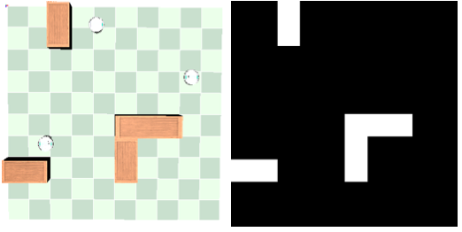
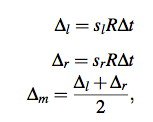
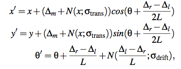
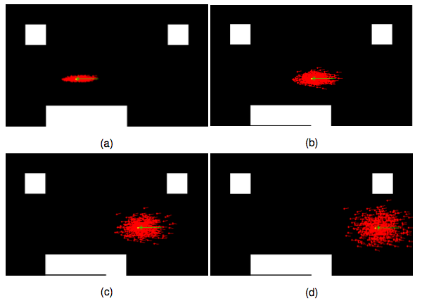
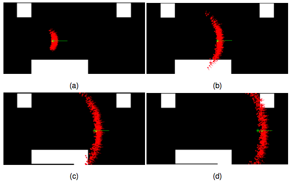
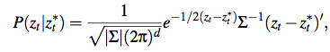
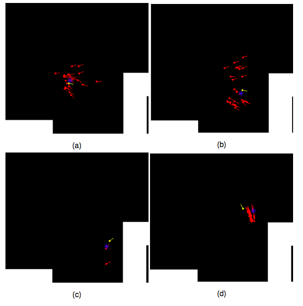
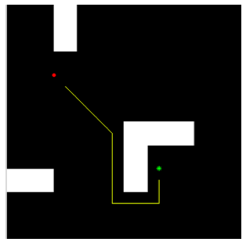
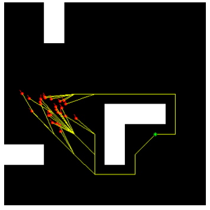

A multi-robot simulation in Webots
==================================

This is an implementation of a multi-robot scenario in which multiple mobile robots need to travel as a team, on a map, to assigned locations. The objective is to minimize response time at the team-level, such that whenever a goal location is generated one of the robots will travel to it as soon as possible. This could be seen as a taxi-hailing situation when a customer places an order and a taxi company sends the closest available vehicle.

For an example of the simulation running when several goal locations are generated and a decision is made as to which robot is assigned, see [this video](http://www.youtube.com/watch?v=ukz1vDEfdZ0)

Implementation
--------------
The simulation was built using Webots 6.x. The controllers were written in Matlab, since matrix operations are performed quickly and it is easier to plot data while the simulation runs. The EPuck robots have an in-memory grid-based representation of the map with the location of the obstacles specified:

The robots navigate the map using a differential steering mechanism. It uses a basic motion model for 2-wheeled robots, with added Gaussian noise for the distance travelled in a period of time and for the orientation. It is important to model these two types of motion error, since the robot's body is subject to drift and slippage as it moves. The equations for the model follow:

which take the left and right wheel speeds in rads/second and convert it to actual travelled distance. Then the distances can be combined with randomly drawn numbers from a univariate normal distribution in order to compute, for a given duration, the predicted coordinates and orientation, i.e. the pose of the robot (x, y, theta):

The problem is that these equations would only provide an estimated pose for a single robot instance. Therefore, in the Webots implementation, the equations above are used at every simulation time step (64 ms) as part of the prediction step of a particle filter (Monte Carlo) localization algorithm. This technique involves creating a set of particles, each of which represents a possible pose of the robot at a given time. The wheel speeds are known and can be used in the motion model to compute predicted locations for each particle. Therefore multiple possible locations are maintained as the robot moves and accrues motion error. The following shows how the particle set expands over a period of motion, in order to account for different possible locations of the robot. Notice how uncertainty in the predicted location increases as the robot moves:

This was the case of high translational noise, in which the robot may drift sideways or it may travel for longer or shorter than desired, for a certain pair of wheel speeds. The next image shows how the prediction model can also assume high rotational noise, in which case the orientation is more uncertain:

In practice, the two noise types need to be balanced and calibrated for the robot's characteristics (e.g. motors, wheel sizes, etc.).

The particle sets begin to carry too much uncertainty after the robot moves for a while, however distance sensors on the robot's body can be used to detect nearby objects. Using the location where the robot started and keeping track of the motions executed, it is possible to compare real sensor readings with the ones expected from measurements done on the in-memory map of the world. This way each particle in the set will have a weight assigned to it, specifying the probability that the robot is actually in that location. This is done using a multi-variate Gaussian sensor model:

This specifies the probability of expected sensor readings for a particle given the actual sensor readings that the robot detects. The relation between sensors is captured in the covariance matrix Sigma.

For example, if certain particles have drifted away and are theoretically located next to a wall, but the robot cannot sense anything nearby as it is still in an open area, then those particles will be assigned low weight and are less important. They will not be taken into consideration as much when computing a predicted state and will gradually be removed from the set at a resampling step. A common way to "refresh" the particle set, is to use a resampling wheel algorithm, in which particles are sampled with replacement with a probability equal to their weight.

The following image shows how a robot's particle set converges as it approaches and senses an obstacle. This allows particles that are in the open and away from an obstacle to be discarded since they would not match the robot's sensor readings. The particles that remain in the set are the ones that could also expect a wall nearby. As the robot drives away from the obstacle, it's location is also easier to predict:

Using particle filter localization, the robot can plan and navigate a path from its current location to a target location. The planning can simply be done with an A* search:

In fact path planning is done from every particle of the robot to the goal:

Each plan is assigned a weight equal to its particle's weight, such that it would be "executed" in proportion to its probability of it being a "true" plan. In the image above, according to solutions from A* some particles are closer to the goal if they go around the object clockwise. But more particles will instruct the robot to go counter-clockwise, which will shift the balance in their favour. The robot will follow the plans that have higher weight. Additionally, path planning is performed continuously and the plans converge as the particle set converges.

Bibliography
-------------

[1] M. B. Dias and A. Stentz, “A free market architecture for distributed control of a multirobot system,” in 6th International Conference on Intelligent Autonomous Systems (IAS-6), pp. 115–122, 2000.

[2] R. Zlot, a. Stentz, M. Dias, and S. Thayer, “Multi-robot exploration controlled by a market economy,” Proceedings 2002 IEEE International Conference on Robotics and Automation (Cat. No.02CH37292), vol. 3, no. May, pp. 3016–3023, 2002.

[3] B. B. P. Gerkey and M. M. J. Mataric, “Sold!: Auction methods for multirobot coordination,” Robotics and Automation, IEEE Transactions on, vol. 18, no. 5, pp. 758–768, 2002.

[4] B. Siciliano and O. Khatib, Springer handbook of robotics. Springer, 2008.

[5] S. Thrun, “Particle filters in robotics,” in Proceedings of the Eighteenth confer- ence on Uncertainty in artificial intelligence, pp. 511–518, Morgan Kaufmann Publishers Inc., 2002.

[6] I. I. M. Rekleitis, “A particle filter tutorial for mobile robot localization,” Centre for Intelligent Machines, McGill University, vol. 3480, 2004.

[7] R. Siegwart and I. R. Nourbakhsh, Intro to Autonomous Mobile Robots. MIT press, 2004.

[8] S. Thrun, W. Burgard, and D. Fox, Probabilistic robotics, vol. 1. MIT press Cambridge, 2005.

[9] F.Mondada,M.Bonani,X.Raemy,J.Pugh,C.Cianci,A.Klaptocz,S.Magnenat, J.-C. Zufferey, D. Floreano, and A. Martinoli, “The e-puck, a robot designed for education in engineering,” in Proceedings of the 9th conference on autonomous robot systems and competitions, pp. 59–65, 2009.
Bibliography 35

[10] A. Stentz, M. B. Dias, R. Zlot, and N. Kalra, “Market-based approaches for co- ordination of multi-robot teams at different granularities of interaction,” Robotics Institute, p. 172, 2004.
